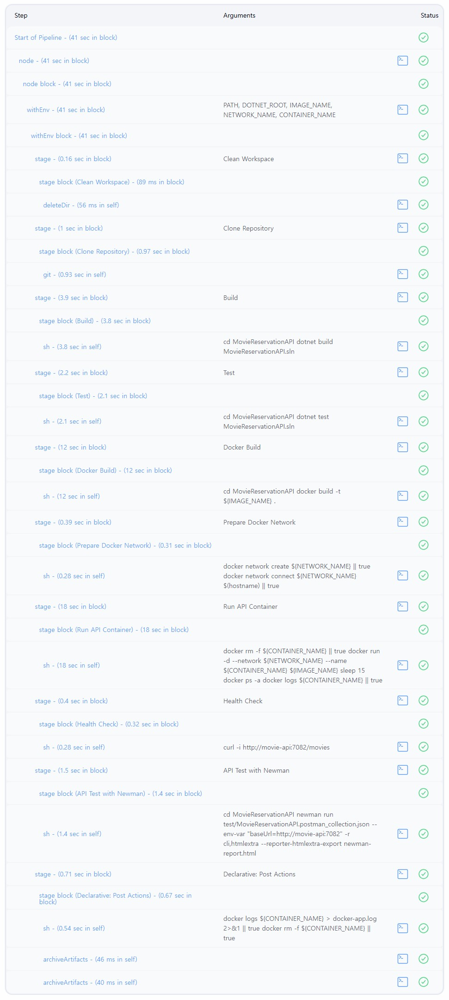
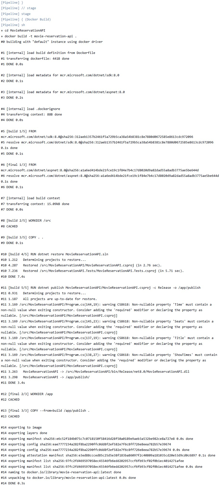
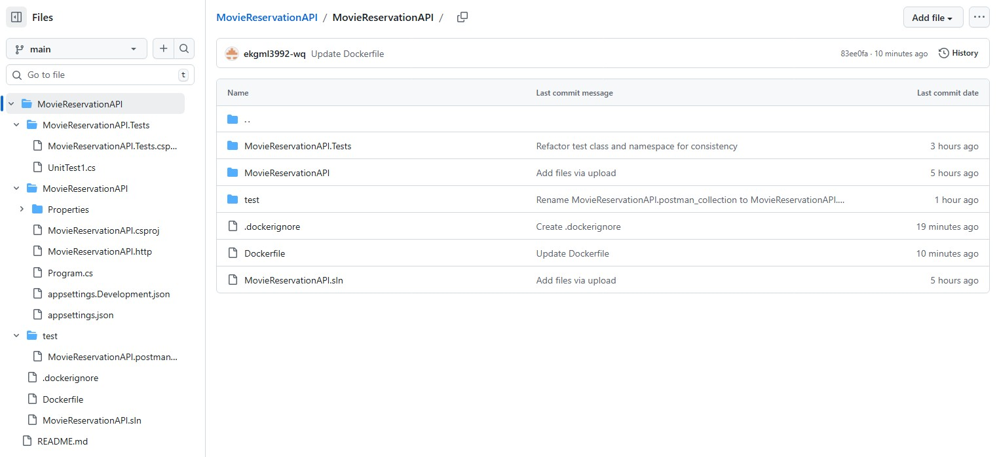

# Movie Reservation API
CI/CD + Docker 기반 API 자동 테스트 프로젝트입니다.

## 프로젝트 소개
영화 목록 조회, 상영시간 조회, 좌석 조회 및 좌석 예약 기능을 제공하는 간단한 REST API입니다.

Jenkins Pipeline과 Docker를 이용하여 API 빌드, 실행, 테스트 과정을 자동화했습니다.

---

## 기술 스택

- C#
- .NET 8 Minimal API
- xUnit
- Jenkins
- Docker
- Postman / Newman

---

## 주요 기능

### 영화 목록 조회
GET /movies

### 상영시간 조회
GET /movies/{movieId}/showtimes

### 좌석 조회
GET /showtimes/{showtimeId}/seats

### 좌석 예약
POST /reserve/{showtimeId}/{seatId}

---

## CI/CD Pipeline

Jenkins Pipeline을 이용하여 다음 과정을 자동화했습니다.

1. GitHub Repository Clone
2. .NET 프로젝트 Build
3. Unit Test 실행
4. Docker 이미지 Build
5. API 컨테이너 실행
6. Health Check
7. Newman API 테스트
8. 테스트 HTML 리포트 생성

---

## 실행 결과

### Jenkins Pipeline

### Docker Build 로그

### API 테스트 결과

### Repository 구조

