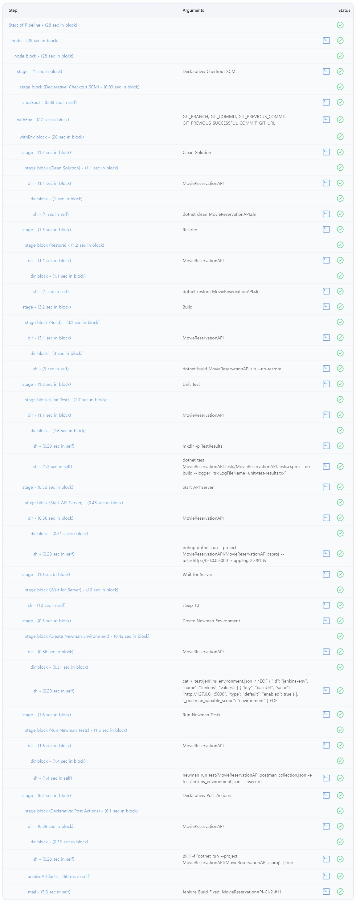
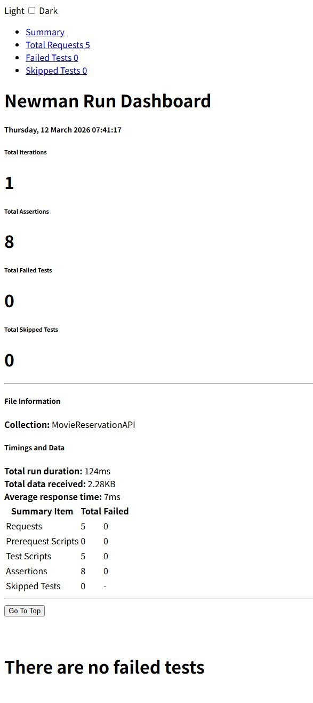

# Movie Reservation API

CI/CD + Docker 기반 API 자동 테스트 프로젝트입니다.  
.NET 8 Minimal API로 영화 예매 REST API를 구현하고,  
xUnit 단위 테스트와 Postman / Newman API 테스트를 통해 기능을 검증했습니다.

또한 Jenkins Pipeline을 통해 빌드, 테스트, Docker 이미지 생성, API 실행, 자동 테스트까지  
전체 과정을 자동화했습니다.

---

# 프로젝트 개요

영화 목록 조회, 상영시간 조회, 좌석 조회 및 좌석 예약 기능을 제공하는   간단한 REST API 서비스입니다.
기능 구현 이후 다음과 같은 테스트 환경을 구축했습니다.

- xUnit 기반 단위 테스트
- Postman Collection 기반 API 테스트
- Newman CLI 기반 자동 API 테스트
- Jenkins Pipeline 기반 CI 자동화
- Docker 기반 API 실행 환경 구성

코드 변경 시 Jenkins Pipeline이 실행되어  
빌드 → 단위 테스트 → Docker 이미지 생성 → API 실행 → Health Check → API 테스트가 자동으로 수행됩니다.

---

# 기술 스택

### Language
- C#

### Framework
- .NET 8 Minimal API

### Testing
- xUnit
- Postman
- Newman

### CI/CD
- Jenkins Pipeline

### DevOps
- Docker

### Tools
- Git
- GitHub

---

# 주요 기능

### 영화 목록 조회

GET /movies

등록된 영화 목록을 조회합니다.

---

### 상영시간 조회

GET /movies/{movieId}/showtimes

특정 영화의 상영시간 목록을 조회합니다.

---

### 좌석 조회

GET /showtimes/{showtimeId}/seats

선택한 상영시간의 좌석 정보를 조회합니다.

---

### 좌석 예약

POST /reserve/{showtimeId}/{seatId}

선택한 좌석을 예약합니다.
이미 예약된 좌석일 경우 예약이 제한됩니다.

---

# 단위 테스트 (xUnit)

MovieReservationService의 핵심 기능에 대해  
단위 테스트를 작성하여 서비스 로직을 검증했습니다.

검증 대상 기능

- 영화 목록 조회
- 상영시간 조회
- 좌석 조회
- 좌석 예약
- 예약 취소
- 좌석 상태 조회
- 좌석 수 집계

정상 동작뿐 아니라 다음과 같은 예외 상황도 함께 테스트했습니다.

- 존재하지 않는 ID 조회
- 중복 좌석 예약
- 예약되지 않은 좌석 취소

이를 통해 다양한 조건에서 서비스 로직이 정상적으로 동작하는지 검증했습니다.

---

# CI/CD Pipeline

Jenkins Pipeline을 이용하여 다음 과정을 자동화했습니다.

1. GitHub Repository Clone
2. .NET 프로젝트 Build
3. xUnit 단위 테스트 실행
4. Docker 이미지 Build
5. API 컨테이너 실행
6. Health Check
7. Newman API 테스트 실행
8. 테스트 결과 리포트 생성

API 서버를 컨테이너로 실행한 후 Newman을 통해 실제 HTTP 요청 기반 API 테스트를 수행하도록 구성했습니다.

---

# Jenkins Pipeline 실행 결과

### Pipeline Stage

---

### Unit Test 실행 결과

---

### Newman API 테스트 결과

---

감사합니다.
